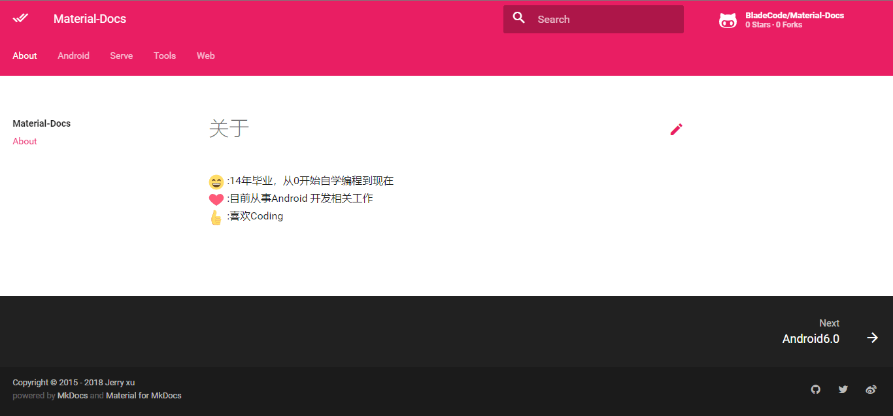

<p align="center">
	<a href="https://pypi.python.org/pypi/mkdocs-material" rel="nofollow">
		
	</a>
	<a href="https://github.com/vuejs/vue">
		
	</a>
	<a href="https://github.com/BladeCode/Material-Docs/master/LICENSE">
		
	</a>
</p>

# Introduction
Document summary,use mkdocs build
* [Preview](https://BladeCode.github.io/Material-Docs)
* [Mkdocs](http://www.mkdocs.org/)
* [Theme](https://squidfunk.github.io/mkdocs-material/)



# Preparation

## Installing Python
``` python
$ python --version
Python 2.7.2
$ pip --version
pip 1.5.2
```
>MkDocs supports Python versions 2.7, 3.3, 3.4, 3.5 and pypy.

## Installing MkDocs

``` python
$ pip install mkdocs
```

## Installing Theme

``` python
$ pip install mkdocs-material
```

## Getting Started

``` bash
mkdocs new my-project
cd my-project
```

## Deploying Pages

``` bash
mkdocs gh-deploy
```
>MkDocs will build your docs and use the [ghp-import](https://github.com/davisp/ghp-import) tool to `commit` them to the gh-pages branch and `push` the gh-pages branch to GitHub.