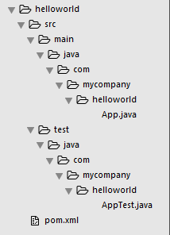
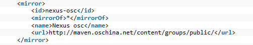

# Maven初体验
2016-01-22 12:01:22

Maven是基于项目对象模型（POM），可以通过一小段描述信息来管理项目的构建，报告和文档的管理工具

## Maven安装
1. 安装JDK，并配置好环境变量
2. Maven：[官网地址](https://maven.apache.org/)
3. 解压下载文件，设置环境变量
    * 变量名：`MAVEN_HOME`
    * 变量值：你放置Maven目录，如`C:\DevTool\Maven\apache-maven-3.3.3`
    * 添加Path：`%MAVEN_HOME%\bin`
4. CMD命令窗口输入：`mvn -v`，回车，可以查看到你当前安装Maven的版本，即安装成功

## Maven项目构建
自动创建项目骨架 

* CMD命令：

`#!js mvn archetype:generate -DgroupId=com.mycompany.helloworld -DartifactId=helloworld -Dpackage=com.mycompany.helloworld -Dversion=1.0-SNAPSHOT`

* 命令解释：
    * `archetype:generate`：列出Maven构建项目模板
    * `DgroupId`：组织名，通常用公司网址的反写+项目名
    * `DartifactId`：项目在组织中唯一标识，通常用项目名+模块名
    * `Dpackage`：代码所存在的包名
    * `Dversion`：版本号

!!! Note  
    1. 第一次构建项目需要链接网络，从网上的 maven 库 (repository) 下载需要文件，存放在本地库（`<C:\YouPCName\.m2\repository\>` ）中  
    2. 文件加载完需要选择你要使用模板的编号（这里选择716即可）`Choose a number or apply filter (format: [groupId:]artifactId, case sensitive contains): 716:716`
    3. 需要选择构建使用的版本号（这里选择最新6对应的版本）`Choose org.apache.maven.archetypes:maven-archetype-quickstart version:6`
    4. 确认构建项目`Confirm properties configuration:y`
    5. 构建过程：[日志](../assets/log/gitpages-maven.log)

项目目录结构  

## Maven项目运行
1. CMD命令，先进入项目文件夹，再输入：`mvn package`
2. 此时，Maven在helloworld项目下面建立一个新的目录target/，构建打包后的jar包文件，`helloworld-1.0-SNAPSHOT.jar`就放在这个目录下；编译后的的class文件放在target/classes/目录下，测试class文件放在target/test-classes/目录下
3. 运行项目，CMD命令：`#!js java -cp target/helloworld-1.0-SNAPSHOT.jar com.mycompany.helloworld.App`，查看是否输出：`Hello World!`

!!! Note  
    1. 当你第一次编译运行maven项目需要链接网络，从网上的 maven 库 (repository)下载需要的程序，存放在本地库（<YouPCName\.m2\repository\> ）中
    2. 编译过程：[日志](../assets/log/gitpages-maven-package.log)
    3. 运行过程：[日志](../assets/log/gitpages-maven-run.log)

## Maven镜像仓库
1. 修改镜像仓库地址
    可能由于国内网络问题，无法访问外网，那么我们就需要修改配置文件，访问国内的Maven镜像仓库地址  
    * settings.xml文件路径（Maven安装路径\conf\settings.xml）  
    如`C:\DevTool\Maven\apache-maven-3.3.3\conf\settings.xml`  
    * 打开settings.xml文件，修改152-157行内容并取消注释  
    
    * 更多详细设置，详情见[开源中国Maven库使用帮助](http://maven.oschina.net/help.html)
2. 修改本地仓库地址
    可能有些时候我们需要自定义更改Maven的本地仓库默认地址
    * settings.xml文件路径（Maven安装路径\conf\settings.xml）  
    如`C:\DevTool\Maven\apache-maven-3.3.3\conf\settings.xml`
    * 打开settings.xml文件，修改53行路径并取消注释  
    `<localRepository>D:/MavenProject/repo</localRepository>`

## Eclipse安装Maven插件
> Eclipse4.0以上版本或者MyEclipse中已经集成了Maven插件，不用手动安装

### Eclipse创建Maven项目
1. New > Maven >Maven Project > Next
2. 选择ArtifactId是maven-archetype-quickstart模板进行构建
3. 根据需要，填写GroupId，ArtifactId，会自动生成Package > Finish

### Eclipse运行Maven项目
1. 展开项目目录结构，选中`pom.xml`文件右键
2. Run As > Maven build... < Goals(输入compile，或者package：compile表示编译，package表示打包)

## POM.xml文件常用标签
1. 常用标签说明
2. 依赖范围：官方文档说明  
    依赖范围是用来控制依赖于三种classpath的关系  
    `compile`：默认范围，编译测试运行都有效  
    `provided`：在编译和测试时有效  
    `runtime`：在测试和运行时有效  
    `test`：只在测试范围有效  
    `system`：于provided使用范围一样，同时与本机系统相关联，可移植性差  
    `import`：导入依赖范围，它只使用在dependencyManagement中，表示从其它的pom中导入dependency的配置
3. 依赖传递：类似可以理解A依赖B,B依赖C,即A依赖C
4. 依赖冲突：
    * 原则1：在路径不同情况下，先解析路径短的依赖  
        如：依赖一、A > B > C > X(jar)  
        依赖二、A > D > X(jar)默认选择会选择这条依赖先解析
    * 原则2：在路径相同情况下，先声明，先解析
5. 聚合与继承  
    在Maven项目中有多个项目，想要install命令安装到本地仓库或其他命令，必须每个项目一次一次执行，Maven一次性进行install命令处理项目的这种方式，叫做聚合  
    在聚合的项目pom中加入modules标签，modules中加入module标签，module标签填入需要聚合项目的地址即可

## Maven构建Web项目
1. New > Maven >Maven Project > Next
2. 选择ArtifactId是maven-archetype-webapp模板进行构建
3. 根据需要，填写GroupId，ArtifactId，会自动生成Package > Finish
4. 展开项目，右键Java Resources > New > Source Folder 
    Project Name：Browse... > 定位到当前项目名  
    Folder Name：src/main/java（第二次src/test/java）
5. 检查class文件输出路径：
    项目右键 > Build Path > Configure Build Path... > Source 下查看
6. 转化项目为Web项目：
    项目右键 > Properties > Project Facets（左侧导航栏）> 勾选Dynamic Web Module选项
7. 修改部署时，项目的默认配置：
    项目右键 > Properties > Deployment Assembly（左侧导航栏）> 移除包含/src/test路径的目录
8. 使用jetty插件运行web项目
    * [Maven中央仓库](http://mvnrepository.com)：搜索jetty
    * 选择Jetty :: Server Core Web Servers，根据需要选择版本，进入版本页面后复制下面图表Maven中的标签地址
    * 粘贴入`pom.xml`文件<plugin>标签中
    * 选择项目，右键 > Run As > Maven build > Goals(输入需要的命令，如：jetty.run)
    * 在控制台Console中显示出`Started Jetty Server`，表名已经成功运行
    * 浏览器中输入：http://localhost:8080/项目名
9. 使用Tomcat运行Web项目
    * 选择 Tomcat 需要的版本
    * 复制示例代码中<plugin>中的坐标
    * 粘贴入`pom.xml`文件中<plugin>标签中
    * 选择项目，右键 > Run As > Maven build > Goals(输入需要的命令，如：package)
    * 在控制台Console中显示出`Started Server Tomcat`，表名已经成功运行
    * 浏览器中输入：http://localhost:8080/项目名  

!!! Note 
    当我们第一次创建，可能由于缺少servlet的api导致.jsp文件报错  
    1. 打开[Maven中央仓库地址](http://mvnrepository.com)：搜索servlet  
    2. 选择Java Servlet API进入，根据需要选择版本，进入版本页面后复制下面图表Maven中的标签地址  
    3. 粘贴入pom.xml文件<dependencies>标签中  
    如果我们在新创建Resource Folder时无法创建，我们切换到Navigator模式下新建Resource Folder即可
