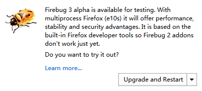
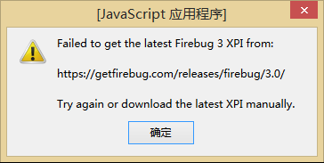

# Firefox Firebug
2015-12-21 13:00:08

Firebug作为Firefox浏览器中最好的插件之一
> Firebug 官网宣布已停止继续开发、更新维护 Firebug 的通知，邀请大家使用 Firefox 内置工具 [DevTools](https://developer.mozilla.org/en-US/docs/Tools)

#### Firebug常用技巧

[Firebug官网](http://getfirebug.com/)  
[Firebug版本库](http://getfirebug.com/releases/firebug/)

#### Firebug常遇问题
Firefox Developer Edition版本上安装Firebug异常  
在附加插件搜索页面搜索Firebug插件安装，在Firefox Developer Edition版本上会强制安装3.0以上版本  

然而，安装完重启浏览器，发现依旧不能使用  

* 原因：Firefox Developer Edition版本上已阻止安装未签名认证的插件
* 解决方法：关闭对插件的签名认证  
    步骤
    1. 地址栏输入`about:config`，点击“我保证会小心”
    2. 搜索框中输入`xpinstall.signatures.required`，双击修改值为“`false`”
* 扩展：由于Firefox Developer Edition版本上已阻止安装未签名认证的插件，所以可能部分插件无法正常安装也是这个原因，解决方法同上