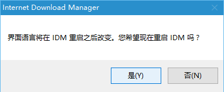

# Internet Download Manager
2016-01-04 23:29:01

[Internet Download Manager](http://www.internetdownloadmanager.com/)（简称IDM）是一个用于Windows系统的下载管理器

功能：

1. 自动下载互联网上的任何文件类型
2. 多个数据流下载时使用更快的下载划分
3. 批量下载
4. 导入/导出下载工作
5. 自动/手动更新下载地址
6. 支持队列操作
7. 拥有近期下载列表，方便访问文件
8. 从流媒体视频网站下载视频
9. 动态分段整个下载过程
10. 支持协议HTTP,FTP,HTTPS,MMS和微软的ISA

## 巧用防火墙屏蔽验证
IDM 享有30天的免费试用，本章主要讲解屏蔽IDM的验证  
**原谅我只是一个穷码农，只为分享交流学习，本教程只用于交流学习，不得用于任何商业行为。**  
`有能力的朋友，请购买正版！`

## 原理
通过防火墙阻断IDM连接自家的网站去验证安装在本机上的IDM序号是否有效，也就是说不是破解他本身的注册机制，而是拦截验证而已

!!! Note
    相关：hosts阻断，防火墙阻断，打补丁方式都是阻断软件通过连接自家网站验证序号是否合法可用

1. hosts：全局禁用，把IDM自家所有网站都指向127.0.0.1这个本地地址
2. 防火墙：只禁止IDM这个程序本身，连接自家网站验证，并不影响你访问IDM的网站，同时也避免hosts修改问题（比如防病毒软件提示风险）,可支持手动覆盖更新安装
3. 打补丁：通过修改IDM程序软件本身，修改程序本身的网站指向或者去掉序号联网验证功能

相关：[软件正版验证方法](https://www.zhihu.com/question/22189064)  

* 低等：提取诸如MAC地址、计算机名等，再组合加密变换，或根据用户名进行计算所
* 中等：网络验证，服务器保存key列表，用户输入正版key后连接服务器检索验证，成功则返回正确标识，以及离线的data文件等；
* 高等：加密狗、驱动等。

## 测试环境
* 测试版本：IDM 6.25 build 10
* 系统版本：Windows 10 64Bit

## 软件安装
1. 没什么好说的，下一步，下一步，完成...
2. 安装完成，会自动检测你的系统语言  

3. 安装过程  

4. 系统对应语言安装完成，重启IDM  

## 屏蔽过程
1. 打开网络和共享中心
    * 方法一：网络连接图标（右键）>打开网络和共享中心
    * 方法二：控制面板>网络和 Internet>网络和共享中心
2. 打开Windows防火墙（网络和共享中心页面，左下角）
3. 建立防火墙出站规则
    * 高级设置>出站规则>新建规则  
    
4. 定位IDM安装路径
    * 程序>定位安装路径>下一步  
    
5. 选择“阻止链接”
6. 全选“域”，“专用”，“公用”
7. 名称：自定义，如：IDM阻断，描述：可不写；完成
8. 添加阻断iP地址
    * 选择“IDM阻断”（右键）>属性  
    
    * 添加阻断iP地址，应用  
    
9. 注册，完工
    * 注册（菜单栏）>注册；内容不重要了，毕竟已经阻断IDM访问验证的iP；序列号：10Z5R-MI9H5-WLASO-1H46W（其他已经不能注册）  
    
    * 确定，会弹出提示，无视关闭  
    
    * 帮助>关于IDM，参看注册信息  
    

## 注意：

!!! warning
    无法屏蔽弹框原因

    1. 可能IDM软件非官网纯净应用
    2. 可能防火墙问题：检查自己的防火墙是否开启（可能第三方应用应用关闭了系统防火墙）
    3. 可能曾安装过破解版或其他原因：注册表中保留了以前的键值，需要删除注册表信息，重新安装
        * `[HKEY_CURRENT_USER\SOFTWARE\DownloadManager]`
        * `[HKEY_LOCAL_MACHINE\SOFTWARE\WOW6432Node\Internet Download Manager]`

## 补充
手动设置系统墙日志，用于查看IDM都连接了那些iP地址  

1. 一般防火墙日志存放路径：C:\Windows\System32\LogFiles\Firewall
2. 如果没有，自行设置
    * Windows防火墙>高级设置>左侧导航栏：本地计算机上的高级安全Windows防火墙（右键）>属性  
    
3. 手动加入阻断IDM验证的防火墙iP地址即可，屏蔽过程第8步

参考：本教程是我无意从IDM贴吧看到，做了整理。由[sasalemma](http://tieba.baidu.com/p/3878377959?pn=1)分享
