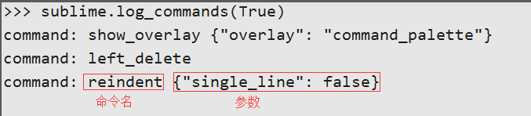

# Sublime Text
2015-11-10 22:59:38

Sublime 作为文本编辑器，却有着相当出色的扩展，并且有着完美的跨平台，Windows,Mac,Linux都能很方便安装使用，是一款轻量IDE，自从接触到它，就被这种方便，快速，优雅的操作所深深吸引。

废话不多说，总结了自己平时常用的操作。

## 一、安装
下载Sublime：[建议下载Sublime Text 3](http://www.sublimetext.com/3)

## 二、安装Package

Package Control

* 方法一：手动安装
    -  GitHub下载Zip：[Package Control](https://github.com/wbond/sublime_package_control)
    - 解压Zip文件，并重新给文件夹命名“ Package Control ”
    - 拷贝解压文件夹到，Sublime菜单栏Preferences > Browse Packages打开【Packages】文件夹
    - 重启Sublime

* 方法二：在线安装【推荐】
    - 进入官网复制对应版本安装代码 Sublime Text 3：[Package Control](https://packagecontrol.io/installation)
    - 快捷键++ctrl+grave++或者通过View->Show Console菜单打开命令行
    - 粘贴复制官网的安装代码，并++enter++
    - 重启Sublime

## 三、常用插件

1. Themes  
虽然Sublime自带Themes，但个人比较喜欢Material Theme  
* ++ctrl+shift+p++，输入：`Install Package`，回车
* 加载完毕后，在窗口中输入`Material Theme`，回车安装
* Sublime菜单栏 Preferences > Color Scheme > Material Theme
2. AdvancedNewFile  
项目树形机构中快速定位，新建，修改，删除文件  
* ++ctrl+alt+n++，打开命令窗口
* 输入：路径/文件名
3. SyncedSideBar  
自动定位打开文件所在树形机构项目中的位置
4. Emmet  
代码补齐
* `#!js ul.new>li*5 `：表示ul的`#!js class="new" `，里面有5个li，写完一个li，可以用Tab键，跳入下一个li中进行编辑
* 对选中内容进行包裹
- 选中要包裹的内容
- ++ctrl+shift+p++ > `#!js wrap with abbrebiation`
- 在下面的命令处，直接进行用 ==.== 设置class, ==#== 设置id等操作

## 四、快捷键

常用快捷键

* 编辑
    - 多行游标：++ctrl+d++
    - 撤销：++ctrl+y++
    - 合并行：++ctrl+j++
    - 选中当前行：++ctrl+l++
    - 删除当前行：++ctrl+shift+k++
    - 格式化粘贴：++ctrl+shift+v++
    - 移动当前行，上/下：++ctrl+shift+arrow-up++ 或者 ++ctrl+shift+arrow-down++
    - 当前行上/下加入光标：++alt+ctrl+arrow-up++ 或者 ++alt+ctrl+arrow-down++
    - 当前行之后，插入新行：++ctrl+enter++
    - 当前行之前，插入新行：++shift+ctrl+enter++
    - 复制光标所在整行，插入到下一行：++ctrl+shift+d++
    - 选中花括号里面的全部内容不包括{}：++ctrl+shift+m++
* 显示
    - 放大字体：++ctrl+plus++
    - 缩小字体：++ctrl+minus++
    - 默认分屏-1屏：++alt+shift+1++
    - 左右分屏-2列：++alt+shift+2++
    - 垂直分屏-2排：++alt+shift+8++
    - 格式化代码(命令模式)：`#!js reindent lines`
* 搜索
    - 关键字：++ctrl+f++
    - 查找替换：++ctrl+h++
    - 项目文件：++ctrl+p++【文件目录/文件名（精确某个文件目录下查找）】
    - 项目文件定位行：++ctrl+p++【文件名:输入数字（文件名可省略，定位当前文件）】
    - 当前文件函数定位：++ctrl+r++
    - 项目文件函数定位：++ctrl+p++【文件名:@函数名（文件名可省略，定位当前文件）】
    - 当前文件变量名，属性：++ctrl+colon++
    - 退出多行编辑，搜索，命令模式：++esc++

自定义快捷键

* 搜Key Binding-User：++ctrl+shift+p++控制面板中输入：`Key Binding-User`
* 配置文件
```json
[
    {"keys":["快捷键方式"],"command":"命令名称","args":{"single_line": false}},
]
```

> 扩展：命令名称确定

* ++ctrl+grave++ 打开控制台，并输入：`sublime.log_commands(True)`，回车执行
* ++ctrl+shift+p++打开命令面板，输入一个操作动作，在下方控制台中就会输出命令的名称，以及参数  

* ++ctrl+s++保存即可