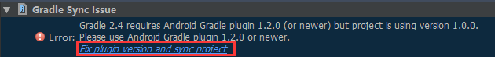

# Cordova 打包
2016-01-13 22:19:18

在WebApp开发时，需要用到Cordova打包，然而一开始接触Cordova的时候，Cordova一会叫PhoneGap，一会又叫PhoneGap Build（情况较少），直接给懵了，不知到底在说哪个

## 三者之间关系
* [Cordova](https://cordova.apache.org/)：PhoneGap的代码贡献给了Apache软件基金会，但保留了PhoneGap的商标所有权，并命名为Apache Callback。1.4版发布后，接着Apache Callback的名称变更为Apache Cordova
* [PhoneGap](https://phonegap.com/)：原本由Nitobi公司开发，在2011年10月4日被Adobe收购
* [Cordova](https://build.phonegap.com/)：是一个在线打包工具，只需上传你的HTML5、CSS和JavaScript文件Adobe®PhoneGap™构建云服务,帮你做编译的工作

!!! info
    总结：你可以这样理解，PhoneGap是原先的名字，Cordova是PhoneGap被捐给Apache之后用的项目名，PhoneGap的名字也被保留了。建议开发就直接使用Crodova

## 安装Crodova
* 安装[Node.js](https://nodejs.org/en/)，由于0.6版本后的Node.js已经包含了[npm](https://www.npmjs.com/)
* 安装[Crodova](https://cordova.apache.org/)，打开CMD命令窗口输入```npm install -g cordova```

!!! note
    安装完Node.js，CMD中输入`npm -v`检查npm版本，如果不是最新版npm，通过`#!js npm install npm -g`命令更新npm最新版本，其中-g代表：安装全局npm

## 创建Crodova项目
* 语法：`#!js cordova create <PATH> [ID [NAME [CONFIG]]] [options] [PLATFORM...]`
* 示例：`#!js cordova create hello com.example.hello HelloWorld`，表示在默认路径（C:\Users\<YourPCName>）下，创建hello目录并在该目录下创建一个包名`com.example.hello` HelloWorld项目
    **语法参数说明**
    * `PATH`：Where to create the project，也就是项目工程路径
    * `ID`：reverse-domain-style package name - used in <widget id>，也就是项目包名
    * `NAME`：human readable field，也就是项目名称
    * `CONFIG`：json string whose key/values will be included in [PATH]/.cordova/config.json Options（选项）:
    * `--copy-from |src=<PATH>` ... use custom www assets instead of the stock Cordova hello-world
    * `--link-to=<PATH>` ......... symlink to custom www assets without creating a copy

## 添加开发平台
* Add Platforms需要你的PC上已经安装好该Platforms的SDK，最好给SDK设置好环境变量
* 进入到项目中cd Name，示例：`#!js cd hello`
* 给项目添加Platforms，语法：`#!js cordova platform add <platform name>`，示例：`#!js cordova platform add android`

## 编译，安装，运行项目
* 编译项目：`#!js cordova build android`
* 安装项目：
    方法一：  
    * 准备：在你放置AndroidSDK的路径下，打开AVD Manager创建一个模拟器，可以参考：Google Android开发指南或者Cordova手册都有详细创建模拟器过程
    * 输入命令：`#!js cordova run android`（如果你之前已经创建过模拟器，就能自己部署应用到模拟器上）
    方法二：（适用已安装好Genymotion）  
    * 启动Genymotion模拟器
    * 定位到项目生成的apk文件，拖动到Genymotion内，自动安装
    方法三：（推荐，适用已安装好Android Studio，不需要用cordova build android命令编译）  
    * 启动Android Studio
    * 启动页面，选择Import project(Eclipse ADT,Gradle，etc.)方式打开  
    
    * 定位到项目platforms下android文件夹，示例：D:\hello\platforms\android
    * Android Studio会自动用Gradle编译  
    
    * 编译完成，进入Android Studio工作界面，可能由于Gradle版本高，需要更新Gradle plugin，点击修复就好  
    

!!! note
    1. 使用命令`#!js cordova build android`，第一次这个过程是需要链接网络，需要在线下载Gradle，下载是gradle-2.2.1
    2. 使用Android Studio编译，下载是Gradle库中最新版本，目前是gradle-2.4
    3. Gradle放置默认路径：`C:\Users\<YourPCName>\.gradle\wrapper\dists\gradle-2.2.1-all\2m8005s69iu8v0oiejfej094b`和`C:\Users\<YourPCName>\.gradle\wrapper\dists\gradle-2.4-all\6r4uqcc6ovnq6ac6s0txzcpc0`
    4. 不能删除字符串文件夹，如果不能在执行编译过程中在线下载Gradle，那么请从其他渠道下载Gradle这两个版本，解压后文件夹分别为gradle-2.2.1和gradle-2.4放入到各自版本默认的字符串文件夹下面

附件：[命令方式完整Cordova打包日志](../assets/log/gitpages-cordova-create-project.log)

参考：[知乎](https://www.zhihu.com/question/21649237)，[维基百科](https://zh.wikipedia.org/w/index.php?title=Adobe_PhoneGap&redirect=no)，和各自官网
