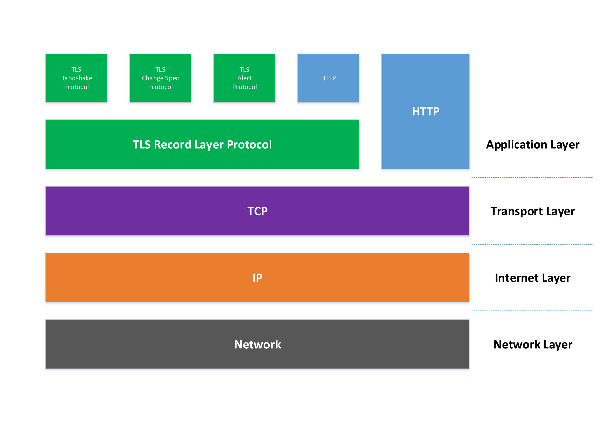

# HTTPS原理浅析
2017-06-10 15:30:00

为解决HTTP协议在安全上（信息窃听，信息篡改，信息劫持）等不足，而诞生了HTTPS技术。HTTPS提供了信息加密，信息的完整性校验，身份的验证等技术有效的解决了在HTTP上存在的安全问题

## HTTPS概要
HTTPS(Hypertext Transfer Protocol Secure)：超文本传输安全协议，常称为`HTTP over TLS`，`HTTP over SSL`或`HTTP Secure`，是一种网络安全传输协议。

HTTPS 是建立在密码学基础之上的一种安全通信协议，HTTPS经由HTTP(超文本传输协议)进行通信，利用`SSL/TLS`来加密数据包，严格来说是基于 HTTP 协议和 `SSL/TLS` 的组合。

!!! Note
    * `TLS/SSL`是一种安全协议  
    * `TLS`(Transport Layer Security)：是在传输层上层的协议，应用层的下层，作为一个安全层而存在。TLS的前身是SSL(Secure Sockets Layer)  
    * `TLS/SSL`关系  
        * SSL2.0
        * SSL3.0
        * TLS1.0(SSL3.1)
        * TLS1.1(SSL3.2)
        * TLS1.2(SSL3.3)

## HTTPS原理

 HTTPS关键技术

### 加密技术
常用加密算法：  
**对称加密**：采用对称密码编码技术，也就是编码和解码采用相同描述字符（加密和解密使用相同的密钥），实现这种加密技术的 **算法** 称对称加密算法。

!!! tip
    特点：对称加密使用简单，密钥较短，加密和解密过程较快  
    常见对称加密算法：`DES`,`3DES`,`IDEA`,`AES`,`RC4`等

**非对称加密**：和对称加密不同，其加密算法需要两个密钥：*公钥*和*私钥*，两者是一对。

!!! tip
    特点：非对称加密保密性好，但加密和解密时间较长，只适合对少量数据或者小文件加密  
    常见非对称加密算法：`RSA`,`ECC`,`DSA`等

**HASH算法**：一种单向算法，通过Hash算法可以和目标数据生成一段特定长度，唯一的Hash值，但是不能通过Hash值重新计算出原始数据，因此也称为*摘要算法*

!!! tip
    特点：是一种不可逆的加密算法，常用在不需要数据还原的加密及数据完整性校验  
    常见Hash算法：`MD2`,`MD4`,`MD5`,`SHA`等

### 身份验证  

**非对称加密** 最大的一个问题，就是无法证明公钥本身就是货真价实的公钥。因此使用证书来证明公钥是否正确

CA（Certificate Authority）：负责管理和签发证书的第三方权威机构，是所有行业和公众都信任的、认可的。

CA的作用是检查证书持有者身份的合法性，并签发证书（在证书上签字），以防证书被伪造或篡改，以及对证书和密钥进行管理。

CA证书使用过程

HTTPS协议栈

TLS包含4个核心子协议：  

* 握手协议`Handshake protocol`，
* 密钥规格变更协议`Change Ciper Spec protocol`，
* 警报协议`Alert protocol`

